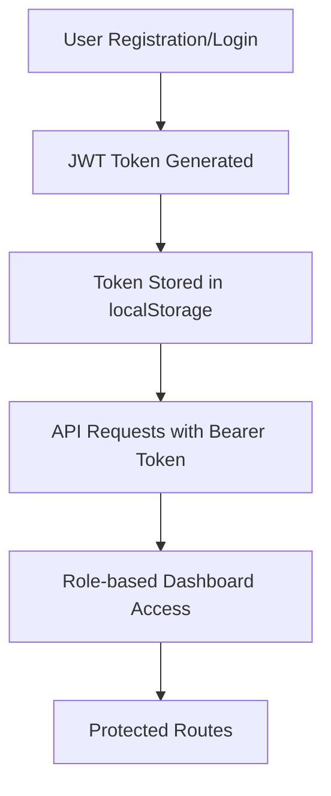

# 🚀 Career Pulse Frontend

> A modern, responsive job search platform that connects talented professionals with amazing opportunities

[](https://reactjs.org/)
[](https://www.typescriptlang.org/)
[](https://vitejs.dev/)
[](https://tailwindcss.com/)
[](https://opensource.org/licenses/MIT)

## 🌟 Overview

Career Pulse is a comprehensive job search and recruitment platform designed to bridge the gap between job seekers and employers. Built with modern web technologies, it provides an intuitive, responsive interface for discovering opportunities, managing applications, and connecting with potential employers or candidates.

## ✨ Key Features

### 👤 For Job Seekers
- 🔍 **Advanced Job Search** - Filter by location, category, salary, and more
- 📝 **Professional Profiles** - Create and customize your professional presence
- 📊 **Application Tracking** - Monitor your job applications in real-time
- 💬 **Direct Messaging** - Communicate with employers seamlessly
- 📱 **Mobile Responsive** - Access opportunities on any device
- 🌙 **Dark Mode Support** - Eye-friendly interface for extended usage

### 🏢 For Employers
- 📋 **Job Posting** - Create and manage job listings effortlessly
- 👥 **Candidate Management** - Review and manage applications
- 🎯 **AI-Powered Matching** - Find the best candidates for your roles
- 📈 **Analytics Dashboard** - Track recruitment metrics and performance
- 🏷️ **Company Branding** - Showcase your company culture and values
- 💼 **Recruitment Tools** - Streamlined hiring process

### 🔧 Technical Features
- ⚡ **Fast Performance** - Optimized with Vite and modern build tools
- 🛡️ **Type Safety** - Full TypeScript implementation
- 🎨 **Modern UI** - Built with Radix UI and Tailwind CSS
- 🔄 **Real-time Updates** - Live notifications and chat
- 📱 **PWA Ready** - Progressive Web App capabilities
- 🌐 **Accessibility** - WCAG compliant interface

## 🚀 Quick Start

### Prerequisites
- Node.js 18+ 
- npm or yarn package manager

### Installation

1. **Clone the repository**
```bash
git clone https://github.com/your-username/careerpulse-frontend.git
cd careerpulse-frontend
```

2. **Install dependencies**
```bash
npm install
# or
yarn install
```

3. **Environment Configuration**
```bash
# Copy the example environment file
cp .env.example .env.local

# Update the API endpoints to point to your backend
# Edit .env.local with your backend URL
```

4. **Start development server**
```bash
npm run dev
# or
yarn dev
```

5. **Open your browser**
Navigate to `http://localhost:5173` to see the application.

## 🏗️ Project Structure

```
careerpulse-frontend/
├── 📁 public/                 # Static assets
├── 📁 src/
│   ├── 📁 components/         # Reusable UI components
│   │   ├── 📁 auth/          # Authentication components
│   │   ├── 📁 chat/          # Chat and messaging
│   │   ├── 📁 home/          # Landing page components
│   │   ├── 📁 jobs/          # Job-related components
│   │   ├── 📁 layout/        # Layout components
│   │   ├── 📁 profile/       # User profile components
│   │   └── 📁 ui/            # Base UI components
│   ├── 📁 pages/             # Route components
│   ├── 📁 services/          # API services
│   ├── 📁 utils/             # Utility functions
│   ├── 📁 hooks/             # Custom React hooks
│   ├── 📁 types/             # TypeScript type definitions
│   └── 📁 styles/            # Global styles
├── 📄 package.json
├── 📄 vite.config.ts
├── 📄 tailwind.config.ts
└── 📄 tsconfig.json
```

## 🔧 Available Scripts

| Script | Description |
|--------|-------------|
| `npm run dev` | 🚀 Start development server |
| `npm run build` | 🏗️ Build for production |
| `npm run build:dev` | 🛠️ Build for development |
| `npm run preview` | 👀 Preview production build |
| `npm run lint` | 🔍 Run ESLint |

## 🌐 Backend Integration

This frontend application is designed to work seamlessly with the **Career Pulse Backend** server:

🔗 **Backend Repository**: [https://github.com/XORbit01/career-pulse-backend](https://github.com/XORbit01/career-pulse-backend)

### API Configuration

The application communicates with the backend through RESTful APIs. Key integration points:

- 🔐 **Authentication** - JWT-based user authentication
- 👤 **User Management** - Profile creation and management
- 💼 **Job Management** - Job posting, searching, and applications
- 💬 **Messaging** - Real-time chat between users
- 📊 **Analytics** - User engagement and job metrics

### Environment Variables

```env
# Backend API Configuration
VITE_API_BASE_URL=http://localhost:8000/api/v1
VITE_WS_URL=ws://localhost:8000/ws

# App Configuration
VITE_APP_NAME=Career Pulse
VITE_APP_VERSION=1.0.0
```

## 🎨 UI Components

Built with modern component libraries:

- **Radix UI** - Accessible, unstyled UI primitives
- **Tailwind CSS** - Utility-first CSS framework
- **Lucide React** - Beautiful icon library
- **Framer Motion** - Smooth animations
- **React Hook Form** - Form management
- **Zod** - Schema validation

## 🔐 Authentication Flow



## 📱 Responsive Design

- 📱 **Mobile First** - Optimized for mobile devices
- 💻 **Desktop Enhanced** - Rich desktop experience
- 📊 **Tablet Friendly** - Seamless tablet navigation
- 🌙 **Dark Mode** - Toggle between light and dark themes

## 🚀 Deployment

### Production Build

```bash
# Create production build
npm run build

# Preview the build
npm run preview
```

### Deployment Options

- **Vercel** - Recommended for React applications
- **Netlify** - Great for static sites
- **AWS S3 + CloudFront** - Scalable cloud deployment
- **Docker** - Containerized deployment

### Environment Setup

Ensure your production environment has:

1. ✅ Node.js 18+ runtime
2. ✅ Environment variables configured
3. ✅ Backend API accessible
4. ✅ SSL certificate (HTTPS)
5. ✅ CDN for static assets

## 🤝 Contributing

We welcome contributions! Please follow these steps:

1. 🍴 Fork the repository
2. 🌟 Create a feature branch (`git checkout -b feature/amazing-feature`)
3. 💾 Commit your changes (`git commit -m 'Add amazing feature'`)
4. 📤 Push to the branch (`git push origin feature/amazing-feature`)
5. 🔄 Open a Pull Request

### Development Guidelines

- 📝 Write clear, descriptive commit messages
- 🧪 Add tests for new features
- 📚 Update documentation as needed
- 🎨 Follow the existing code style
- 🔍 Ensure TypeScript types are properly defined

## 📋 Roadmap

### Upcoming Features
- [ ] 🎥 Video interview integration
- [ ] 📊 Advanced analytics dashboard
- [ ] 🌍 Multi-language support
- [ ] 📱 Mobile app (React Native)
- [ ] 🤖 AI-powered job recommendations
- [ ] 📈 Salary insights and trends
- [ ] 🏆 Skills assessment platform
- [ ] 📅 Interview scheduling system

## 🐛 Bug Reports

Found a bug? Please create an issue with:

- 🐛 Clear description of the bug
- 🔄 Steps to reproduce
- 💻 Environment details
- 📸 Screenshots (if applicable)
- 🎯 Expected vs actual behavior

## 📄 License

This project is licensed under the MIT License - see the [LICENSE](LICENSE) file for details.

## 🙏 Acknowledgments

- **React Team** - For the amazing framework
- **Vite Team** - For the lightning-fast build tool
- **Tailwind CSS** - For the utility-first CSS framework
- **Radix UI** - For accessible component primitives
- **Community Contributors** - For their valuable contributions

## 📞 Support

- 📧 **Email**: support@careerpulse.com
- 💬 **Discord**: [Join our community](https://discord.gg/careerpulse)
- 📖 **Documentation**: [docs.careerpulse.com](https://docs.careerpulse.com)
- 🐛 **Issues**: [GitHub Issues](https://github.com/your-username/careerpulse-frontend/issues)

---

<div align="center">
  <p>Made with ❤️ by the Career Pulse Team</p>
  <p>⭐ Star this repository if you found it helpful!</p>
</div>
